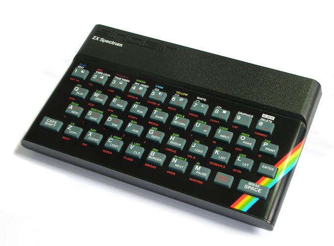

ZX-Uno @ MEGA65: ZX Spectrum Core
=================================

This MEGA65 Core is based on Miguel Angel Rodriguez Jodar's great
[ZX-Uno](https://zxuno.speccy.org/index_e.shtml). It was ported to the MEGA65
in 2020/21 by [sy2002](http://sy2002.de). The ZX Spectrum is quite a machine!
For sure not self-explanatory for beginners and the core does need a specially
prepared SD card, so do not miss the
[Getting Started](https://github.com/sy2002/zxuno4mega65/wiki/Getting-Started)
tutorial.

ZX-Uno @ MEGA65 is licensed under GPL v3,
see [AUTHORS](AUTHORS) for more details.

Special thanks to Miguel for creating ZX Uno and for Andrew, Deft and Paul
or supporting me during my porting adventure.

### Keyboard & Joysticks

There is a [keyboard mapping page in the Wiki](https://github.com/sy2002/zxuno4mega65/wiki/Keyboard-Mapping).

Here is information of [how to use joysticks](https://github.com/sy2002/zxuno4mega65/wiki/Joysticks).

### What works already on a MEGA65 R2

* The basic ZX-Uno core runs (CPU, ULA incl. ULAplus, RAM, ROM, ...)
* 48k BASIC
* VGA output
* Keyboard using a [convenient mapping](https://github.com/sy2002/zxuno4mega65/wiki/Keyboard-Mapping)
* [Joysticks](https://github.com/sy2002/zxuno4mega65/wiki/Joysticks)
* Ability to [emulate a joystick](https://github.com/sy2002/zxuno4mega65/wiki/Keyboard#cursor-keys-standard-and-joystick-mode) via cursor keys.
  By default, a Sinclair joystick is emulated.
* SD-Cards via ESXDOS

### Not working yet

* MEGA65 R3
* HDMI
* Audio
* Mouse

### Scratchpad

#### Documentation TODOs

* Setup: Download EXDOS, hint about SDHC vs. SD, FAT32, ...
* How to start a game: Mention NMI menu, but if this does not work, one might need to switch
  into 48k mode by entering OUT 32765, 48 in basic and then use the EXTDOS dot commands to load:
  explain how. 128k games vs. 48k games. Speed changes.
* EXTDOS basics

#### Keyboard TODOs

* Support PS/2 codes for at least the function keys for Chloe

